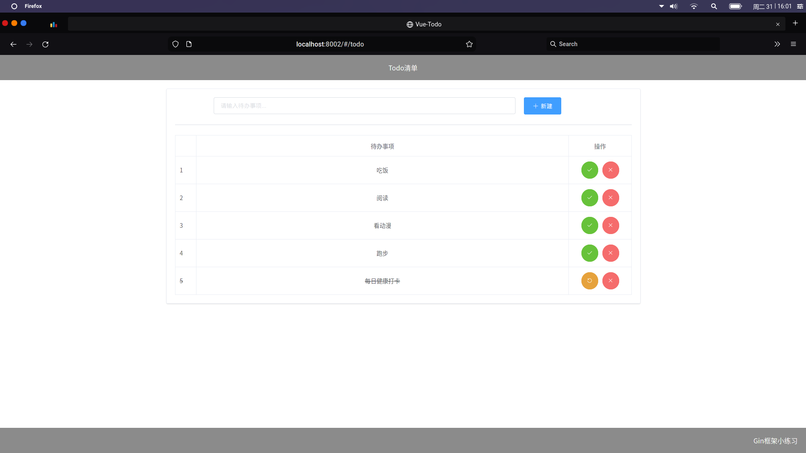

# Vue-Todo

## Project setup
```
npm install
```

### Compiles and hot-reloads for development
```
npm run serve
```

### Compiles and minifies for production
```
npm run build
```

### Lints and fixes files
```
npm run lint
```

## Example

Open the url `http://127.0.0.1:8080/` in your browser.


